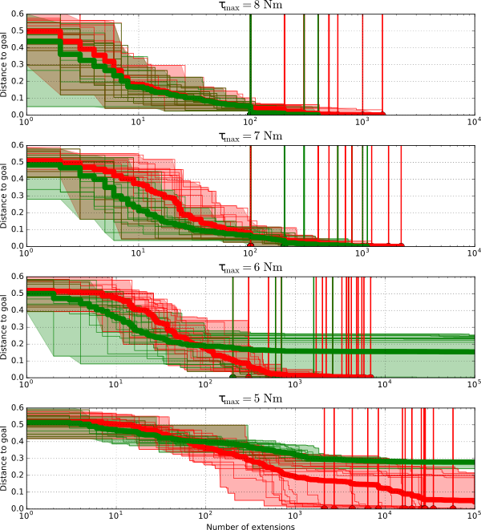

# Completeness of Randomized Kinodynamic Planners with State-based Steering

Source code for the paper https://arxiv.org/pdf/1511.05259.pdf

## Abstract

Probabilistic completeness is an important property in motion planning.
Although it has been established with clear assumptions for geometric planners,
the panorama of completeness results for kinodynamic planners is still
incomplete, as most existing proofs rely on strong assumptions that are
difficult, if not impossible, to verify on practical systems. In this paper, we
focus on an important class of kinodynamic planners, namely those that
interpolate trajectories in the state space.  We provide a proof of
probabilistic completeness for these planners under assumptions that can be
readily verified from the system’s equations of motion and the user-defined
interpolation function. Our proof relies crucially on a property of
interpolated trajectories, termed second-order continuity (SOC), which we
show is tightly related to the ability of a planner to benefit from denser
sampling. We analyze the impact of this property in simulations on a low-torque
pendulum. Our results show that a simple RRT using a second-order continuous
interpolation swiftly finds solution, while it is impossible for the same
planner using standard Bezier curves (which are not SOC) to find any solution

Authors:
[Stéphane Caron](https://scaron.info),
[Quang-Cuong Pham](https://www.normalesup.org/~pham/) and
[Yoshihiko Nakamura](http://www.ynl.t.u-tokyo.ac.jp/)

## Benchmark results

The benchmark run in the paper considered four settings, one for each integer 
torque limit from 5 to 8 Nm, with 20 runs for each setting. Results are 
summarized by the following plots, with RRT-Bezier in green and RRT-SOC in red
(see the paper for details).

